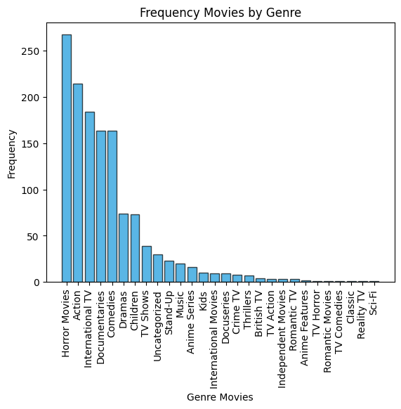

# Netflix Movies - Exploratory Data Analysis (EDA)


This project performs an Exploratory Data Analysis (EDA) on Netflix's movie catalog, focusing on productions released by 1990s. I used Python and specialized libraries to extract insights about trends and movie durations during this period.

## Summary
- [Introduction](#introduction)
- [Features](#features)
- [Technologies Used](#technologies-used)
- [EDA Architecture](#eda-architecture)
- [Analysis](#analysis)
  - [Distribution of Movie Durations (1990s)](#distribution-of-movie-durations-1990s)
  - [Frequency of Movie Releases (1990s)](#frequency-of-movie-releases-1990s)
  - [Most Common Movie Genres](#most-common-movie-genres)


## Features
- Filtering movies released from 1990 onwards
- Statistical analysis of movie durations
- Data visualization with histograms
- Identification of the most frequent genres
- Analysis of top directors and actors
- Trends in movie releases over time

## Technologies Used
- Python 3.x
- Pandas
- Matplotlib
- NumPy
- Jupyter Notebook

## Installation and Execution
1. Clone this repository:
   ```sh
   git clone https://github.com/DanMO23/Netflix_90s_EDA
   ```
2. Navigate to the project directory:
   ```sh
   cd Netflix_90s_EDA
   ```
3. Create a virtual environment and install dependencies:
   ```sh
   python -m venv venv
   source venv/bin/activate  # On Windows: venv\Scripts\activate
   pip install -r requirements.txt
   ```
4. Run Jupyter Notebook:
   ```sh
   jupyter notebook
   ```

## Dataset
The project uses the `netflix_data.csv` file, containing the following columns:

| Column | Description |
|--------|-------------|
| `show_id` | Show ID |
| `type` | Type of show |
| `title` | Show title |
| `director` | Director |
| `cast` | Cast |
| `country` | Country of origin |
| `date_added` | Date added to Netflix |
| `release_year` | Year of release |
| `duration` | Duration in minutes |
| `description` | Description |
| `genre` | Genre |


## EDA's Architecture
Using a Jupyter Notebook container, it integrates components such as the DataLoader (Pandas) for data loading, the Visualizer (Matplotlib) for visualizations, the StatsEngine (NumPy) for statistical analysis, and the DataProcessor (Pandas) for data manipulation, allowing data analysts to efficiently and intuitively explore and understand data.

The diagram below, created using Mermaid syntax, illustrates the architecture of the EDA environment. It shows the interaction between the data analyst and the various components within the Jupyter Notebook container. The components include the DataLoader for loading data, the Visualizer for creating visualizations, the StatsEngine for performing statistical analysis, and the DataProcessor for processing and manipulating data.

```mermaid
graph TB
    User((Data Analyst))

    subgraph "Data Analysis Environment"
        subgraph "Jupyter Notebook Container"
            NotebookApp["Jupyter Notebook<br>Python"]
            
            subgraph "Analysis Components"
                DataLoader["Data Loader<br>Pandas"]
                Visualizer["Visualization Engine<br>Matplotlib"]
                StatsEngine["Statistical Analysis<br>NumPy"]
                DataProcessor["Data Processor<br>Pandas"]
            end
        end

        subgraph "Data Storage"
            CSVStore["Movie Database<br>CSV"]
            ImageStore["Visualization Storage<br>PNG"]
        end
    end

    subgraph "Output Artifacts"
        DurationHistogram["Duration Analysis<br>PNG"]
        GenrePlot["Genre Distribution<br>PNG"]
        ReleaseFreq["Release Frequency<br>PNG"]
    end

    User -->|Interacts with| NotebookApp
    NotebookApp -->|Uses| DataLoader
    DataLoader -->|Reads| CSVStore
    
    DataLoader -->|Processes data through| DataProcessor
    DataProcessor -->|Analyzes with| StatsEngine
    StatsEngine -->|Visualizes via| Visualizer
    
    Visualizer -->|Generates| DurationHistogram
    Visualizer -->|Generates| GenrePlot
    Visualizer -->|Generates| ReleaseFreq
    
    DurationHistogram -->|Stored in| ImageStore
    GenrePlot -->|Stored in| ImageStore
    ReleaseFreq -->|Stored in| ImageStore

    style NotebookApp fill:#2d2d2d,stroke:#fff
    style CSVStore fill:#2d2d2d,stroke:#fff
    style ImageStore fill:#2d2d2d,stroke:#fff
```

##  Analysis
I have created various visualizations to explore different aspects of the dataset:

### Distribution of Movie Durations (1990s)


```python
import matplotlib.pyplot as plt

plt.hist(movies_duration_1990, bins=100, color="#3498db", edgecolor="black", alpha=0.7)
plt.xlabel("Duration (minutes)")
plt.ylabel("Frequency")
plt.title("Distribution of Movie Durations")
plt.show()
```

### Frequency of Movie Releases (1990s)


```python
plt.hist(movie_filtered_1990["release_year"], bins=10, color="#e74c3c", edgecolor="black", alpha=0.7)
plt.xlabel("Release Year")
plt.ylabel("Frequency")
plt.title("Frequency of Movies Released")
plt.show()
```

### Most Common Movie Genres


```python

genre_counts = movies_df["genre"].value_counts().head(10)
plt.bar(genre_label, short_movie_count_genre, color="#1498db", edgecolor="black", alpha=0.7)

plt.xlabel("Number of Movies")
plt.ylabel("Genre")
plt.title("Most Common Movie Genres")
plt.show()
```


## Future Improvements
- Adding sentiment analysis for movie descriptions
- Expanding data visualization with interactive dashboards
- Incorporating machine learning to predict movie success

## Contribution
If you wish to contribute, feel free to open an *issue* or submit a *pull request*.

## License
This project is under the MIT license.

---
Developed by [Danilo Matos](https://github.com/DanMO23) 

