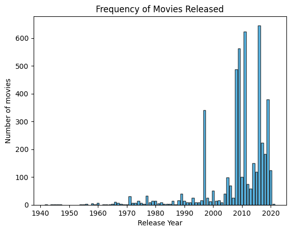

# 🎬 Netflix Movies - Exploratory Data Analysis (EDA)

This project performs an Exploratory Data Analysis (EDA) on Netflix's movie catalog, focusing on productions released in the 1990s. We use Python and specialized libraries to extract insights about trends and movie durations during this period.

## 📌 Features
- Filtering movies released from 1990 onwards
- Statistical analysis of movie durations
- Data visualization with histograms
- Identification of the most frequent genres
- Analysis of top directors and actors
- Trends in movie releases over time

## 🛠️ Technologies Used
- Python 3.x
- Pandas
- Matplotlib
- NumPy
- Jupyter Notebook

## 📥 Installation and Execution
1. Clone this repository:
   ```sh
   git clone https://github.com/your-username/netflix-eda.git
   ```
2. Navigate to the project directory:
   ```sh
   cd netflix-eda
   ```
3. Create a virtual environment and install dependencies:
   ```sh
   python -m venv venv
   source venv/bin/activate  # On Windows: venv\Scripts\activate
   pip install -r requirements.txt
   ```
4. Run Jupyter Notebook:
   ```sh
   jupyter notebook
   ```

## 📊 Dataset
The project uses the `netflix_data.csv` file, containing the following columns:

| Column | Description |
|--------|-------------|
| `show_id` | Show ID |
| `type` | Type of show |
| `title` | Show title |
| `director` | Director |
| `cast` | Cast |
| `country` | Country of origin |
| `date_added` | Date added to Netflix |
| `release_year` | Year of release |
| `duration` | Duration in minutes |
| `description` | Description |
| `genre` | Genre |

## 📈 Example Analysis
We created various visualizations to explore different aspects of the dataset:

### 🎞️ Distribution of Movie Durations (1990s)


```python
import matplotlib.pyplot as plt

plt.hist(movies_duration_1990, bins=100, color="#3498db", edgecolor="black", alpha=0.7)
plt.xlabel("Duration (minutes)")
plt.ylabel("Frequency")
plt.title("Distribution of Movie Durations")
plt.show()
```

### 🕒 Frequency of Movie Releases (1990s)


```python
plt.hist(movie_filtered_1990["release_year"], bins=10, color="#e74c3c", edgecolor="black", alpha=0.7)
plt.xlabel("Release Year")
plt.ylabel("Frequency")
plt.title("Frequency of Movies Released")
plt.show()
```

### 🎭 Most Common Movie Genres


```python

genre_counts = movies_df["genre"].value_counts().head(10)
plt.bar(genre_label, short_movie_count_genre, color="#1498db", edgecolor="black", alpha=0.7)

plt.xlabel("Number of Movies")
plt.ylabel("Genre")
plt.title("Most Common Movie Genres")
plt.show()
```


## 🚀 Future Improvements
- Adding sentiment analysis for movie descriptions
- Expanding data visualization with interactive dashboards
- Incorporating machine learning to predict movie success

## 🤝 Contribution
If you wish to contribute, feel free to open an *issue* or submit a *pull request*.

## 📜 License
This project is under the MIT license.

---
Developed by [Your Name](https://github.com/DanMO23) 🚀

